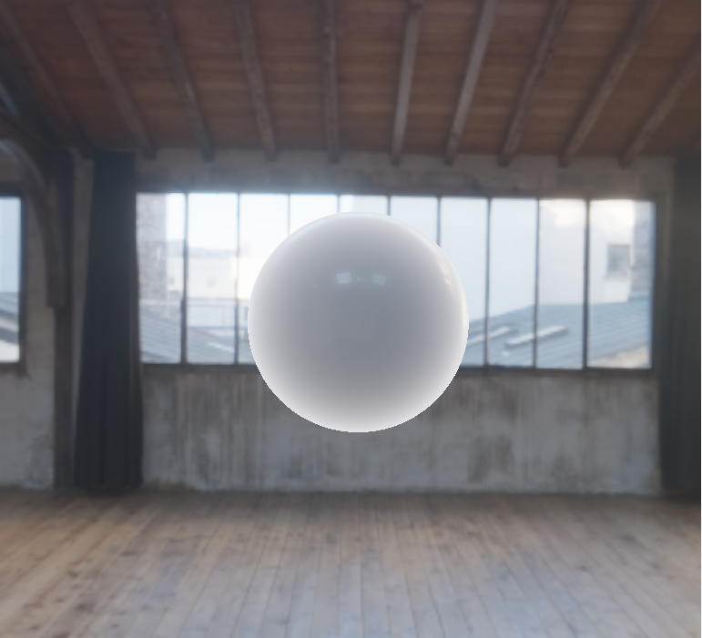
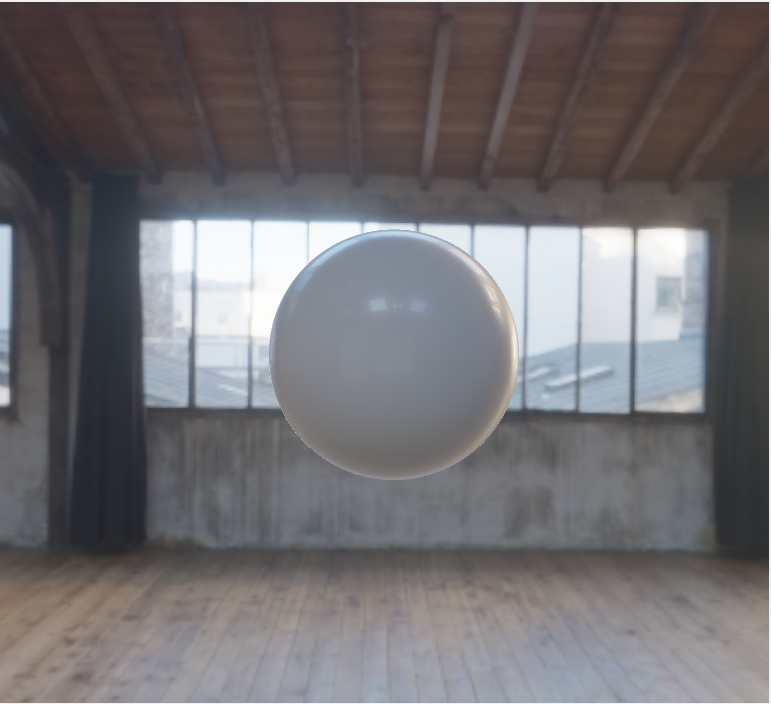

Signed Distance Fields and Subsurface Scattering
======================

**University of Pennsylvania, CIS 561: Advanced Computer Graphics, Homework 8**

Overview
------------
Now that you have a real-time approximation of a microfacet BSDF, you will use
it as a shader for raymarched surfaces. You will get to exercise your spatial
reasoning skills, as well as your creativity, to make a model out of signed
distance fields.

We have provided base code similar to the one you used in homeworks 6 and 7; you
will copy your Cook-Torrance BSDF approximation into the `sdf.pbr.glsl` file
in order to use it as a surface shader for your SDF models.

Useful Reading
---------
Nearly any resource you find in the internet pertaining to signed distance fields
will have some reference back to [this article by Inigo Quilez](https://iquilezles.org/articles/distfunctions/). Please read through it for its vast bounty of 3D SDF definitions as well
as some helpful utility functions. You are free to use any of them in this assignment.

Updating this README (5 points)
-------------
Make sure that you fill out this `README.md` file with your name and PennKey,
along with screenshots of your results.

Updating `sdf.pbr.glsl` (5 points)
--------------
As mentioned above, you must copy your implementation of the Cook-Torrance BSDF
from homework 7 into the function `metallic_plastic_LTE`, found in `sdf.pbr.glsl`.
You will use this function to determine the color reflected by your SDF surfaces.

Implementing `raymarch` (15 points)
----------
In `sdf.frag.glsl`, you will find the declaration of the `raymarch` function.
Implement this function so that it performs the sphere-marching technique we
discussed in the raymarching slides, and returns the `t` value of the intersection
found along with a `BSDF` representing the material properties at that point.
You will need to make use of at least the `sceneSDF` function defined in
`sdf.defines.glsl`. We have provided a body for this function that should
render a red sphere just like the default scene in homework 07, if you have
correctly implemented `raymarch`.

Improving `sceneSDF` (25 points)
----------
This is your chance to be creative! Once you are confident in your implementation
of `raymarch`, you should write
a new body for `sceneSDF` that assembles an interesting object composed of
signed distance fields. What you choose to portray is up to you, but the code
that assembles it should be of similar complexity to the code used in `SDF_Wahoo`.
Additionally, you must make use of:
- At least three different signed distance field functions
- Translation, rotation, and scale operations
- Strict or smooth-blended union, intersection, or subtraction boolean operations

Creating `BSDF`s for your model (15 points)
----------
Write a function in the style of `BSDF_Wahoo` that returns the material
properties of a point in your scene. Your `raymarch` function should call
this function in order to set the `BSDF` component of its `MarchResult` return
value. Your model should be composed from materials of differing roughness, metallicness,
and albedo.

Adding approximated subsurface scattering (15 points)
----------
Update the `BSDF` struct so that it has a `float` attribute for
surface thinness. Using the SDF-approximated ambient occlusion
formula discussed in the "Visual Effects" slides, add code to
your `BSDF` computation function that evaluates how thin a surface
is given a point on that surface and the direction from which light
would travel through the object. Since we have access to the diffuse
irradiance map from homework 7, you can treat this light direction
as the pole of the hemisphere aligned with -&#969;o. In
other words, the hemisphere that gathers light from the opposite side of
the model we are viewing.

Once you have this thinness value, you can add code in `main` that
combines your diffuse irradiance with the subsurface light attenuation
formula (again in the "Visual Effects" slides) to compute a subsurface
scattering value. This value should then be further attenuated by `(1 - metallic)`
since we only want plastic materials to let light through. Add your subsurface
light to the color returned by `metallic_plastic_LTE` to make your plastic
surfaces glow from the light in the scene behind them. In order to allow
some artistic direction to the glow distribution and intensity, consider adding
additional variables to your `BSDF` struct that match with the values needed in
the subsurface scattering function and thinness estimation function.

Here are two example renders of a plastic sphere with and without subsurface
lighting. It used a thinness `k` of `2.0`, thinness search distance of `0.085`,
subsurface distortion of `0.2`, subsurface glow of `6.0`, subsurface scale of `3.0`,
and no additional ambient subsurface light.

Repeating your model through space (20 points)
--------
Using either the `opRep` function discussed in [this article by Inigo Quilez](https://iquilezles.org/articles/distfunctions/), or the grid-based SDF repetition function we discussed in class with the smooth-blended metallic spheres, replicate your object throughout your scene.

Importantly, your replication should have your object vary in the following ways:
- Differing positions within each repetition cell
- Differing BSDF properties between one repetition cell and another
- Differing transformations (e.g. scale, bend, twist, etc.) between one repetition cell and another 

Extra credit (20 points maximum)
-----------
Using the tools you implemented above, create an artistic composition made of several different SDF objects. You are welcome to look at Shadertoy for inspiration, or even try to replicate some artwork or a scene from a film.

Submitting your project
--------------
Along with your project code, make sure that you fill out this `README.md` file
with your name and PennKey, along with your test renders.

Rather than uploading a zip file to Canvas, you will simply submit a link to
the committed version of your code you wish us to grade. If you click on the
__Commits__ tab of your repository on Github, you will be brought to a list of
commits you've made. Simply click on the one you wish for us to grade, then copy
and paste the URL of the page into the Canvas submission form.
