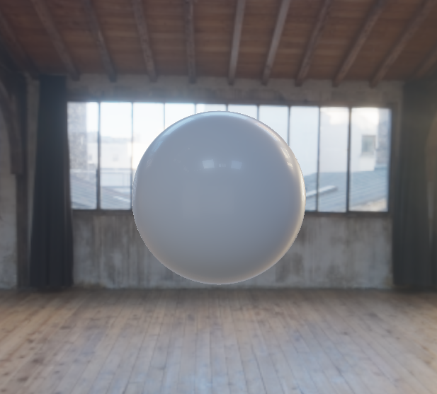

Ray Marching
======================

  

Ray marching is a method of rendering 3D objects by iteratively stepping along rays cast out by the camera and into the scene. When moving along this ray, functions called signed distance fields (SDFs) tell us how far away we are from any given object. SDFs not only tell us if we have hit an object, but also how far we might need to move to hit an object. Using those two properties we can create complex 3D geometry in real-time that would normally be very expensive to create using triangles.

Consider the below sphere. We would need an infinite number of infinitely small triangles here to create a perfectly smooth sphere, or we would need a specialized equation to figure out the collision between our view and the sphere - this second option, while acceptable for primitive objects like spheres, does not scale well with complexity. SDFs get around this by simply answering the question, "at some point along my ray, how far away am I from this sphere?" and ray marching does the rest by traversing along the ray by that queried distance.

  

Now spheres are fine and all, but what if we wanted to make something more complex (like a friendly little octopus)? SDFs work great for these kinds of shape too since we can combine two of these functions [in a number of ways](https://iquilezles.org/articles/distfunctions/#:~:text=Primitive%20combinations). This let's us make a nice round friend:

  

But we wouldn't want them to be lonely, we can give him some friends too. Since our SDFs are just the distance from some surface to our ray, we can pretend our ray is looping through a box with our octopus in it (i.e. when it hits the edge of the box it loops to the other side). When our ray does this looping action, it finds another octopus to sample, and we have then created an infinite number of octopi with relatively low performance cost compared to an infinite number of possible ray-mesh intersections in a traditional rasterization or ray tracing approach.

  

  

Subsurface Scattering
---------------------

One additional benefit of having SDFs, is the ability to approximate subsurface scattering (the effect caused by light scattering inside a translucent object). Notice that around the edges, where the surface is thinner, more light from the bright background seeps through and lightens up the surface. Whereas the light cannot propagate through the center of the sphere as it's simply too much material to get through.

| With Subsurface Scattering  | Without Subsurface Scattering |
| ------------- | ------------- |
|   |   |

  

___

[Inigo Quilez - Distance Functions](https://iquilezles.org/articles/distfunctions/)

[SDF Bend Function](https://www.shadertoy.com/view/3llfRl)
